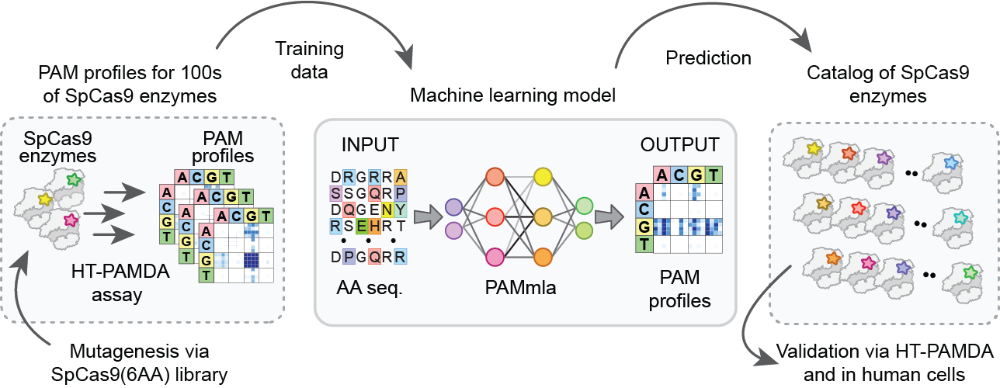
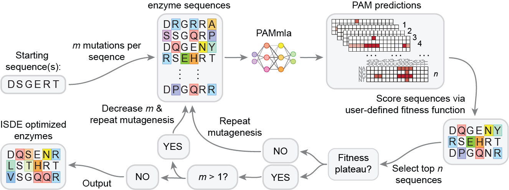

# PAMmla

### PAMmla is a set of machine learnign models to predict SpCas9 PAM preference from amino acid sequence as described in the manuscript ***"Design of custom CRISPR-Cas9 PAM variant enzymes via machine learning"*** (Silverstein et al. 2024).
[A web tool](https://pammla.streamlit.app/) to facilitate making predictions and running in silico directed evolution is also available.



## Requirements
This code was developed using Python version 3.3.18 and Conda 23.7.4. Package requirements are listed in ```PAMmla_env.yaml```

## Installation Guide
Installation time: ~ 5 min

1. Clone the github repository

    ```git clone https://github.com/RachelSilverstein/PAMmla_ISDE.git```

2. Create a conda environment from the provided yaml file

    ```conda env create --name PAMmla_env --file=PAMmla_env.yml```

3. Activate the conda environment

    ```conda activate PAMmla_env```

4. Add the PAMmla_env environment to ipykernel (only necessary if using the jupyter notebook to train PAMmla model)

    ```python -m ipykernel install --user –name=PAMmla_env```


## Making predictions from a saved model
This functionality is also provided in the [PAMmla web tool](https://pammla.streamlit.app/).

Three pre-trained neural network models are available: 
```220924_NN_rand_seed0_ROS```, ```220924_NN_rand_seed2_ROS```, and  ```220924_NN_rand_seed3_ROS```.
These models are three instances of training the ```AA_to_PAM_NN.ipnb``` model using different train/test splits and should behave similarly. They correspond to the 3 train/test splits in the manuscript Silverstein et al. 2024.

A pre-trained linear model is also provided, ```240614_linear_optimized_seed0_ROS```. This is the optimized linear model
described in Silverstein et al. 2024 and performs with similar accuracy to neural network based models. 

Predictions from each of these models can be generated using the ```make_predictions.py``` script.

First, fill in the ```INPUTS``` section at the top of the ```make_predictions.py``` script. See parameters section below for details.
The file is currently populated with inputs to generate example predictions for SpG (LWKQQR) and wild type SpCas9 (DSGERT).

Then run the script using ```python make_predictions.py```. This will create a folder in your running directory called 'predictions' which contains the output of the script in the form of a csv file.

### Parameters:
 
```pred_run_name``` : A name to identify the run. Using a previously used name will overwrite previous results in the 'predictions' directory.

```saved_model_dir```: Directory containing the model to be used to generate predictions. Ex. ```"./220924_select_rand_seed0_ROS"```

```choose_muts```: If True, create predictions for a list of given mutants. Mutants will either be read from ```chosen_muts_file``` or input in ```chosen_muts``` parameter.

```chosen_muts```: List of pCas9 amino acid variants to generate predictions for. Mutants are denoted by the amino acids present at positions 1135, 1136, 1218, 1219, 1337 as a 6-character strings. Ex. To denote WT SpCas9, use ```["DSGERT"]```

```chosen_muts_from_file```: True or False. If True, variants are provided in a csv file instead of using the ```chosen_muts``` parameter.

```chosen_muts_file```: Path to a csv file with a single column of variants names as 6 character strings as described above. Only used if ```chosen_muts_from_file``` is True.

```random_muts```: Alternative to choose_muts where random mutants are generated

```positions_to_randomize```: If random_muts parameter is True, positions listed in this list will be randomized. Must only contain a combination of the following positions: ```['D1135', 'S1136', 'G1218', 'E1219', 'R1335', 'T1337']``` 

```n_samples```: Number of variants to generate predictions for if ```random_muts``` is True.

```make_plots```: True or False. Whether to plot predicted PAM heatmaps in addition to outputting predictions csv.


## In Silico directed evolution

In silico directed evolution powered by the PAMmla model can be performed using the ```evolve_vars.py``` script. 
This functionality is also provided in the [PAMmla web tool](https://pammla.streamlit.app/).



### Running ISDE
First, fill in the ```INPUTS``` section at the top of the ```evolve_vars.py``` script and fill in the arguments to the ```evolve()``` function call at the end of the script. 
See parameters section below for details.

The file is currently populated with inputs to evolve a variant to maximize selectivity for NGTN PAMs starting from 
the wild type SpCas9 amino acid sequence, DSGERT.

Then run the script using ```python evolve_vars.py```. This will create a folder in your running directory called 'predictions' which contains the output of the script in the form of a csv file.
This will generate a folder called ```evolved``` in the output directory containing evolution results. 

The expected output of this example run can be found in ```evolved > NGT_selectivity_example > final_variants.csv```


### Parameters

```pred_run_name``` : A name to identify the run. Using a previously used name will overwrite previous results.

```output_dir``` : Path to location to output results (where ```evolved``` dir will be generated)

```saved_model_dirs```: List of directories containing the models to be used to generate predictions. If more than one
directory is listed, the predictions from all listed models will be averaged together to perform evolution.

Ex. To average predictions from all 3 pre-trained models:

```
saved_model_dirs = ["./220924_select_rand_seed0_ROS", "./220924_select_rand_seed2_ROS", "./220924_select_rand_seed3_ROS"]                
```

```save_traj``` : True or False. Whether to save the entire evolution trajectory (outputs after each round of selections) 
or only save variants from the final round of selections.

```selection_function```: function used to perform selections. ```select_custom``` perfoms all functionalities.

```mutations_per_variant```: starting number of amino acid changes per variant to generate. This number will decay as evolution progresses.

```variants_per_round```: number of mutant enzymes to generate per starting variant per round of evolution. Large numbers will increase probability of 
obtaining optimal variants but also increase runtime. Suggested to keep below 1000 on normal machines.

```n_best_variants_per_round```: number of 'best' variants to keep during each round of selections. Large numbers will increase probability of 
obtaining optimal variants but also increase runtime. Total number of variants on which to generate predictions 
is ```variants_per_round * n_best_variants_per_round``` so choosing large values of both of these parameters will cause slow runtimes.

```decay_after_n_rounds_plateau```: Number of evolution rounds to perform once a fitness plateau is reached before decaying the number of mutations per variant.

```pam_to_max```: Four nucleotide PAM to maximize activity for (must begin with N) ex. 'NGTG'. If not maximizing activity, set to ```None```.

```pam_to_min```: Four nucleotide PAM to minimize activity for (must begin with N) ex. 'NGTG'.
If not minimizing activity, set to ```None```.
If both ```pam_to_max``` and ```pam_to_min``` are provided, the ratio of ```pam_to_max / pam_to_min``` will be maximized.

```high_pams```: PAMs for which you are providing additional constraints on the rate constant required to survive selections. 
Activity on these PAMs must remain **above** the rate constant thresholds specified in ```high_cutoffs```

```low_pams```: PAMs for which you are providing additional constraints on the rate constant required to survive selections. 
Activity on these PAMs must remain **below** the rate constant thresholds spescfied in ```low_cutoffs```

```high_cutoffs```: log10 rate constant cutoff values for PAMs specified in ```high_pams``` in the corresponding order.
Should be between -1 (highest activity) and -5 (lowest activity).

```low_cutoffs```: log10 rate constant cutoff values for PAMs specified in ```low_pams``` in the corresponding order
Should be between -1 (highest activity) and -5 (lowest activity).

```pams_to_max_selectivity```: Provide this parameter to sort for maximizing ***selectivity*** for PAMs of interest. List of 4nt PAMs beginning in N for which to maximize selectivity (sum of rate constants on PAMs
of interest divided by sum of all rate constants). 
This can be interpreted as the fraction of total activity which occurs on the PAMs of interest. 
If this parameter is provided, then any parameters provided for ```pam_to_max``` or ```pam_to_min``` will be overridden.
To leave this parameter blank, input ```None```.

```starting_variants```: List of variants to initiate evolution form or input `'random'` to use a randomly generated list of `variants_per_round` number of variants.

Ex. to initiate evolution from a pool of two specified sequences, WT SpCas9 (DSGERT) and SpG (LWKQQR):
```
starting_variants= [["D", "S", "G", "E", "R", "T"], ["L", "W", "K", "Q", "Q", "R"]]
```


### Example function calls to ```evolve()```

This example evolves variants to maximize selectivity for NGTN PAMs starting from the wild type DSGERT amino acids. 
1000 variants are generated per round, each containing 4 amino acid changes relative to the starting sequence.
After each round of mutagenesis, the top 10 variants are retained for the next round of mutagenesis and selections.

```
vars, traj = evolve(selection_function=select_custom,
                    mutations_per_variant=4,
                    variants_per_round=1000,
                    n_best_variants_per_round=10,
                    decay_after_n_rounds_plateau=4,
                    saved_model_dirs=saved_model_dirs,
                    all_pams=pams,
                    aa_positions=all_positions,
                    pam_to_max=None,
                    pam_to_min=None,
                    high_pams=[],
                    high_cutoffs=[],
                    low_pams=[],
                    low_cutoffs=[],
                    pams_to_max_selectivity=["NGTG", "NGTA", "NGTT", "NGTC"],
                    starting_variants= [["D", "S", "G", "E", "R", "T"]]
                    ramp_up_rounds=0  
                    )
```

This example evolves variants to maximize activity on NGTG PAMs while requiring that activity on NGGG and NGGA PAMs remain below 10^-4.
Here we start from 1000 randomly generated variants instead of specifying a starting sequence.

```
vars, traj = evolve(selection_function=select_custom,
                    mutations_per_variant=4,
                    variants_per_round=1000,
                    n_best_variants_per_round=10,
                    decay_after_n_rounds_plateau=4,
                    saved_model_dirs=saved_model_dirs,
                    all_pams=pams,
                    aa_positions=all_positions,
                    pam_to_max='NGTG',
                    pam_to_min=None,
                    high_pams=[],
                    high_cutoffs=[],
                    low_pams=['NGGG', 'NGGA'],
                    low_cutoffs=[-4, -4],
                    pams_to_max_selectivity=[],
                    starting_variants= 'random'
                    ramp_up_rounds=0  
                    )
```

## PAMmla model source code

Source code for pre-processing the training data, training the model, and evaluating the model on the test set is provided in the form of a Jupyter notebook, `AA_to_PAM_NN.ipynb`.
The majority of the data in the manuscript, with the exception of feature importance analyses, were generated using the neural network based model.
The NN models described in the manuscript, "Design of custom CRISPR-Cas9 PAM variant enzymes via machine learning", can be reproduced
by running the notebook as-is with random seed set to either 0, 2, or 3 (representing the three train test splits used for the three provided saved models).
Minor differences compared to saved models may be observed due to differing random states for model weight initiation. To reproduce results exactly, generate predictions from the three saved models: 
```220924_NN_rand_seed0_ROS```, ```220924_NN_rand_seed2_ROS```, and  ```220924_NN_rand_seed3_ROS```.

The optimized linear model described in the manuscript can be reproduced by running the Jupyter notebook `AA_to_PAM_linear.ipynb` as-is.
Further exploration of feature importance is provided in the ```feature_exploration.ipynb``` notebook.


